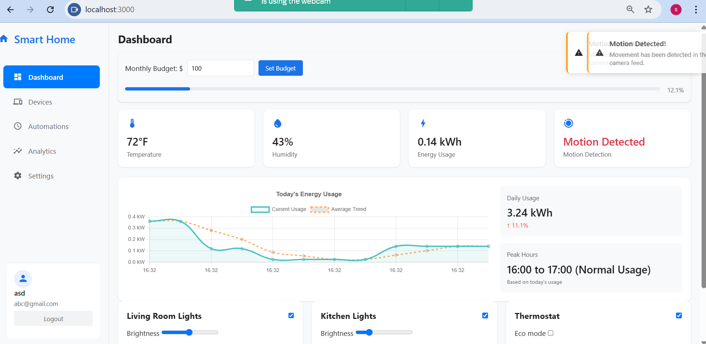
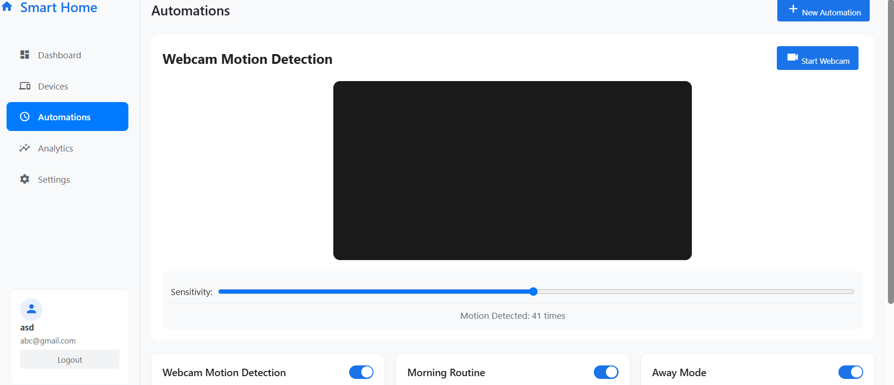
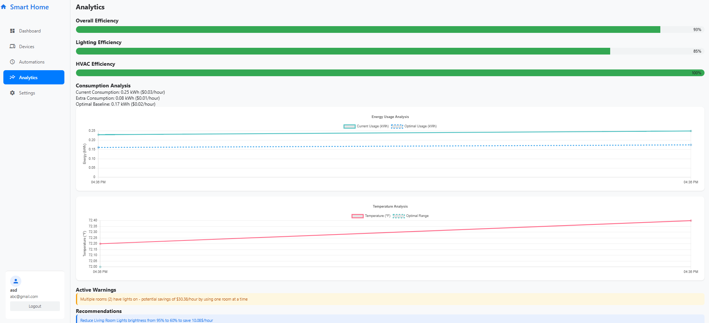
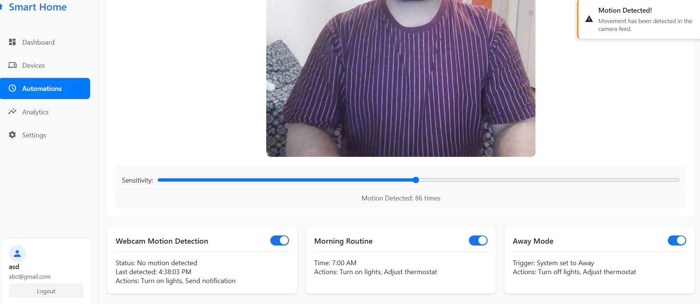

# Smart Home Automation Simulation

CAPSULE (Context-Aware Predictive Smart Home Use & Logic Engine) is a real-time simulated smart home automation dashboard system that allows you to control virtual devices (lights, fans, doors) with instant updates across all connected clients.

---

## 📸 Screenshots
### 📊 System Architecture


*A high-level architecture diagram showing the flow between client, server, device management, energy monitoring, and error recovery in the Smart Home Capsule system.*

### Dashboard Overview

*Main dashboard showing device controls and real-time status*

### Device Controls

*Interactive device controls for lights, thermostat, and more*

### Energy Analytics

*Real-time energy usage and cost analytics*

### Webcam Integration

*Webcam motion detection feature*

---

## 🚀 Features

- ⚡ Real-time device state updates using Socket.IO
- 🖥️ Modern, responsive UI
- 💡 Multiple device controls (lights, fans, doors, thermostat)
- 🔄 Instant synchronization across all connected browsers
- 📷 Webcam motion detection (browser-based)
- 🔒 Secure authentication with JWT & bcrypt
- 📊 Energy usage and cost simulation
- 💾 In-memory state management

---

## 🧠 Main Algorithms & Logic

| Feature                  | Algorithm/Logic Used                | Purpose                                 |
|--------------------------|-------------------------------------|-----------------------------------------|
| Authentication           | bcrypt hashing, JWT                 | Secure login/session                    |
| Device State Management  | In-memory state, logic              | Track/control devices                   |
| Real-Time Sync           | Socket.IO events                    | Instant updates across clients          |
| Energy Usage Calculation | Custom arithmetic                   | Simulate energy consumption             |
| Cost Calculation         | Custom arithmetic                   | Show energy costs/savings               |
| Webcam Access            | getUserMedia, frame differencing    | Live feed, motion detection             |
| User Management          | Validation, hashing, JSON storage   | Register/manage users                   |
| Error Handling           | Try/catch, user alerts              | Robustness, user experience             |

**Note:** No advanced AI or machine learning algorithms are used. The project relies on custom logic, arithmetic, and standard web technologies for its features.

---

## 🛠️ Prerequisites

- Node.js v14 or higher
- npm (Node Package Manager)

---

## ⚙️ Installation

1. Clone this repository or download the files
2. Navigate to the project directory
3. Install dependencies:
   ```bash
   npm install
   ```

---

## ▶️ Running the Application

1. Start the server:
   ```bash
   npm start
   ```
2. Open your web browser and navigate to:
   ```
   http://localhost:3000
   ```

---

## 🖱️ How to Use

1. Open the dashboard in multiple browser windows/tabs
2. Click the toggle buttons to control different devices
3. Observe real-time updates across all connected windows
4. Each device's state is synchronized across all clients
5. Try the webcam motion detection feature for added interactivity

---

## 📁 Project Structure

- `server.js` - Main server file with Express and Socket.IO setup
- `public/index.html` - Frontend dashboard with device controls and webcam
- `package.json` - Project dependencies and scripts

---

## 🧰 Technologies Used

- Node.js
- Express.js
- Socket.IO
- HTML5
- CSS3
- JavaScript (ES6+)
- bcryptjs, jsonwebtoken
- node-webcam (for potential webcam integration)

---

## ✨ Customization & Contribution

- Fork the repo and submit pull requests for new features or improvements.
- Any suggestions are welcome!

---

## 📄 License

This project is open-source and available under the MIT License. 
